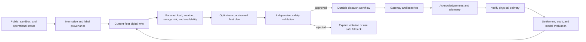

# GridOS full product specification

**Status:** implementation specification  
**Updated:** 2026-09-26  
**Companion architecture:** [`TECHSTACK.md`](TECHSTACK.md)  
**Dataset inventory:** [`DATASETS.md`](DATASETS.md)

## 1. Product definition

GridOS is an operations, forecasting, optimization, and orchestration system
for a distributed fleet of residential batteries. It turns independently
operating devices into reliable, auditable grid capacity while preserving the
backup reserve promised to each household.

The complete operating loop is:

```text
Observe -> Forecast -> Optimize -> Approve -> Dispatch -> Verify -> Learn
```

The product is more than a dashboard. It must decide what the fleet can safely
do, execute that decision despite device and network failures, prove what was
physically delivered, and explain every result.

### Product promise

> Coordinate thousands of home batteries as dependable grid infrastructure
> without silently trading away household resilience.

## 2. Why some data is synthetic

“Synthetic” does **not** mean the data can never be real. It means the value is
simulated until its owner supplies it through an authorized operational or
sandbox integration.

Public sources provide market prices, regional load, weather, outages, grid
models, aggregate load shapes, and selected aggregate fleet examples. They do
not provide a lawful or reliable source for private household telemetry,
addresses, battery credentials, member preferences, or the real mapping from a
home to electrical infrastructure.

Those missing fields are synthetic in the first version for five reasons:

1. **Privacy:** household load, address, device state, and outage behavior can
   reveal occupancy and daily routines.
2. **Authorization:** command credentials and internal identifiers cannot be
   inferred, scraped, or manufactured as though they were production values.
3. **Truthfulness:** invented values must be labeled instead of being presented
   as real operational performance.
4. **Repeatability:** a seeded fleet and scenario clock make failures and demo
   outcomes reproducible.
5. **Engineering independence:** the complete control loop can be built and
   tested before a private integration is available.

The replacement boundary is deliberate: simulators and production connectors
implement the same contracts. When authorized data arrives, the connector is
replaced; forecasting, optimization, safety, orchestration, and the operator UI
remain unchanged.

### Data truth classes

Every record, metric, and UI view must retain one of these provenance values:

| Value | Meaning |
| --- | --- |
| `CONFIRMED_PUBLIC` | Obtained from a named public source and used within its terms. |
| `CONFIRMED_SANDBOX` | Supplied through an explicitly authorized test or organizer environment. |
| `AUTHORIZED_OPERATIONAL` | Supplied by an approved production integration. |
| `DERIVED` | Computed from identified source records; lineage must be retained. |
| `SIMULATED` | Generated for testing, demonstration, or scenario analysis. |

At minimum, ingested and derived records retain `provenance`, `source_id`,
`source_uri`, `observed_at`, `ingested_at`, `schema_version`, and an optional
`simulation_seed`. The UI must visibly mark simulated views. It must never
display a fake street address or imply that simulated fleet performance is an
actual commercial result.

## 3. Users and their jobs

### Fleet operator

- See fleet availability, health, reserve, and active exceptions.
- Plan, approve, launch, pause, and terminate dispatch events.
- Recover devices and workflows that fail or become stale.
- Compare commanded power with verified physical delivery.

### Grid and market operations

- Identify valuable dispatch windows from market and grid conditions.
- Understand feasible capacity before making a commitment.
- Measure performance, revenue, and non-performance exposure.
- Replay an event from the exact inputs and policies used at decision time.

### Utility or grid partner

- Request support within a permitted geographic/electrical region.
- Inspect aggregate capacity and delivered response.
- Receive an auditable event report without access to household data.

### Deployment and field operations

- Find areas where new batteries or repairs create the most value.
- Inspect device health, communications quality, and maintenance priority.
- Correlate fleet gaps with grid, outage, and customer-resilience needs.

### Member

- Understand current backup readiness and expected duration.
- See why the battery did or did not participate in an event.
- Select a resilience plan and understand its reserve, price, and risk tradeoff.
- Schedule or end Travel Flex windows and see the resulting credit.
- Receive unusual home-energy-activity alerts while marked away.
- Configure approved reserve preferences and critical-load assumptions.
- View savings and participation outcomes without control-plane complexity.

## 4. End-to-end system behavior



### Control invariants

1. A household reserve is never silently relaxed.
2. The optimizer proposes; an independent safety gate approves or rejects.
3. A command acknowledgement proves receipt, not physical delivery.
4. Delivery is proven from fresh telemetry against a defined measurement rule.
5. Duplicate commands are harmless through idempotency keys and monotonic
   command versions.
6. Stale telemetry reduces or removes a device's eligibility.
7. Commands have explicit activation and expiry times.
8. The system fails closed when safety inputs are absent or contradictory.
9. Every event is replayable from versioned inputs, policies, and code/model
   versions.
10. A zero-percent customer reserve means no customer-selected buffer above the
    battery's protected operating floor; it never means physical zero energy.
11. Weather, outage risk, battery health, stale telemetry, or member return may
    raise the effective reserve immediately.
12. Additional flexibility is dispatched only when conservative incremental
    margin remains positive after reward, charging, degradation, penalty, and
    support costs.

## 5. Product modules

### 5.1 Fleet command center

The primary operations screen shows:

- Installed MW and MWh.
- Current and forecast dispatchable capacity.
- Capacity reserved for household backup.
- Online, offline, degraded, stale, and maintenance-locked devices.
- Current charge/discharge power and aggregate state of charge.
- Communications latency and acknowledgement health.
- Active events, delivered power, shortfall, and recovery status.
- Weather alerts, outage risk, regional load, and market prices.
- Forecast grid value and verified event value.

Every aggregate metric must expose its timestamp, provenance mix, and freshness.

### 5.2 Geographic and electrical map

The map supports drill-down through:

```text
Market -> load zone -> utility territory -> substation -> feeder -> authorized site
```

Layers include fleet density, available capacity, state-of-charge bands,
connectivity failures, outages, severe weather, active dispatch, price
volatility, modeled constraints, and candidate deployment regions.

Default views use aggregate H3 cells or clusters. Exact site locations require
an authorized operator role. Demonstrations use generated locations or a
clearly licensed synthetic grid model.

### 5.3 Fleet and site digital twins

The fleet twin represents each site's latest accepted state and the aggregate
state derived from it. A site may include:

- Stable internal site and device IDs.
- Approved geographic and electrical associations.
- Battery model, usable energy, power limit, state of charge, temperature,
  state of health, and operating alarms.
- Home load, solar production, grid import/export, and critical-load estimate.
- Connectivity, firmware, telemetry freshness, and command version.
- Reserve policy, forecast backup duration, and dispatch eligibility.
- Effective-dated resilience plan, Travel Flex window, consent version, and
  active safety overrides.
- Predicted probability of command or delivery failure.

The twin is not updated merely because a command was issued. Command intent,
acknowledgement, and measured state are separate facts.

### 5.4 Forecasting

Forecast services produce calibrated intervals, not only point estimates:

- Site and cohort load.
- Solar production where applicable.
- Regional/market load and price.
- Weather and outage risk.
- Battery availability and failure probability.
- Expected state-of-charge trajectory.
- Available power and energy after household reserve.

Forecasts record training window, feature version, model version, issue time,
horizon, and realized error. A deterministic baseline remains available when a
learned model is missing or unhealthy.

### 5.5 Constraint-aware optimizer

The optimizer creates a rolling-horizon cohort plan that balances:

- Grid or market value.
- Commitment tracking.
- Household backup reserve.
- Energy and power limits.
- Charge/discharge efficiency.
- Device temperature and health derates.
- Forecast uncertainty and outage risk.
- Communication reliability.
- Geographic/electrical targeting.
- Battery cycling cost and event penalties.

The result includes the objective breakdown, constraint margins, excluded
devices and reasons, and a feasible fallback. The optimizer cannot send device
commands directly.

### 5.6 Independent safety approval

The Go safety service re-evaluates the proposed plan from canonical operational
state. It validates reserve, energy, power, freshness, maintenance locks,
temperature, allowed region, event window, ramp rate, and aggregate commitment.

Approval produces an immutable plan version. Rejection produces machine-readable
violations and an operator explanation. Any material input change requires a
new version and approval.

### 5.7 Durable orchestration

The dispatch workflow:

1. Freezes the event inputs and eligibility snapshot.
2. Requests a forecast and optimized plan.
3. Obtains safety approval and any required human approval.
4. Writes command intent and transactional outbox records.
5. Delivers idempotent, expiring commands to gateways.
6. Tracks acknowledgements separately from telemetry.
7. Retries transient failures without duplicating physical intent.
8. Excludes or replaces unavailable capacity within policy limits.
9. Verifies delivery throughout the event.
10. Safely ends the event and reconciles late messages.
11. Produces an immutable event report.

### 5.8 Failure laboratory

The simulator can inject offline devices, delayed telemetry, dropped or
duplicated messages, gateway restart, worker restart, partial region outage,
bad forecasts, hot batteries, stale state, and optimizer timeout. Scenarios are
seeded, named, replayable, and scored against the same acceptance criteria.

### 5.9 Verification and event accounting

For every event, GridOS reports:

- Requested, approved, commanded, acknowledged, and delivered MW/MWh.
- Baseline and measurement method.
- Response latency, tracking error, availability, and confidence.
- Reserve violations prevented and devices excluded by reason.
- Modeled gross value, degradation cost, penalty exposure, and net value.
- Data gaps, assumptions, provenance, and model versions.

Financial outputs remain **modeled** until actual contracts, settlement rules,
and statements are supplied.

### 5.10 Resilience plans and Travel Flex

Members can choose a permanent resilience plan and optionally schedule a
temporary Travel Flex window.

- **Resilience Max** retains a larger customer backup buffer.
- **Balanced** trades some reserve for greater savings or rewards.
- **Grid Flex** permits a customer-designated reserve as low as zero above the
  protected hardware and dynamic safety floor.

Exact names, reserve bands, prices, and rewards are versioned by market rather
than hard-coded. A plan change records informed consent, effective time, policy
version, and the explanation shown to the member.

Travel Flex records a start, end, local timezone, temporary reserve preference,
and early-return action. The member sees a fixed daily, event, or annual credit;
a per-kWh discount is not the default because an empty home may consume little
energy. The window expires automatically. Early return, severe weather, outage
risk, stale telemetry, device alarms, or loss of communications restores a
safer reserve.

While a home is marked away, the system may compare load against a consented
baseline and send an unusual-energy-activity alert. This is a secondary signal,
not a burglary, fire, or life-safety guarantee.

### 5.11 Flexibility economics and pricing

The decision service evaluates each plan or Travel Flex action using:

```text
incremental margin = added dispatch or market value
                   + avoided peak or capacity cost
                   + commitment reliability value
                   - charging energy
                   - incremental degradation
                   - penalty exposure
                   - member reward
                   - incremental support and risk cost
```

The optimizer uses additional capacity only when a conservative estimate clears
a configured margin hurdle. Membership charges, energy rates, installation
prices, and flexibility rewards remain separate concepts because the applicable
commercial structure varies by utility territory. All offers use an
effective-dated pricing catalog and retain the exact price and contract version
shown to the member. A bill-and-value simulator explains the expected member
savings and company margin without presenting modeled results as guarantees.

## 6. Data available now

The workspace currently contains roughly 808 MB of public data. Exact files,
columns, sources, licenses where known, and date ranges are documented in
[`DATASETS.md`](DATASETS.md).

### Aggregate fleet and grid examples

- Monthly aggregate fleet capacity and partition history.
- Five-minute aggregate dispatch scoring samples.
- Thirty-second issued, SCED, and realized power samples.
- State-estimator line-flow examples and a PTDF constraint example.
- EIA electricity-consumption history and scenario projections.

These support realistic aggregate visualizations and verification prototypes.
They do not reveal the underlying private device fleet.

### Texas market and system data

- ERCOT 2025–2026 day-ahead settlement-point prices.
- ERCOT 2025–2026 real-time settlement-point prices.
- Recent ERCOT system load by weather zone.
- ERCOT residential backcast load profiles across weather zones and profile
  classes.

### Texas outages and weather

- 754,216 historical Texas outage events from 2021-01-01 through 2023-12-20,
  covering 66 utilities.
- Samples of the underlying outage time series.
- Point-in-time NWS forecasts and alerts for Austin, Houston, Dallas, and San
  Antonio.

Weather snapshots are not current feeds and must be refreshed for live use.

### Illinois/PJM/ComEd data

- PJM day-ahead and real-time hourly prices for 2021–2025.
- PJM five-minute real-time prices for the first half of 2025.
- ComEd five-minute and day-ahead price captures.
- NREL Illinois residential load profiles by building type and end use.
- EIA-930 balancing-authority and subregion load, generation, and interchange.
- Supporting Illinois demand, weather, rate, and forecast material listed in
  the dataset manifest.

### Public data that can be integrated next

Subject to source terms and validation, the system can add:

- HIFLD, utility, regulator, EIA, SMART-DS, ACTIVSg, or other published grid
  topology and territory layers.
- Utility hosting-capacity and interconnection maps.
- ERCOT, PJM, EIA, NWS/NCEI, Census, and NREL live or historical feeds.
- Licensed/open household load and battery research datasets such as NREL
  End-Use Load Profiles and other explicitly permitted studies.
- Full outage time series where redistribution and usage terms permit it.

Public topology is suitable for regional analysis or demonstration; it must not
be represented as the exact operational feeder mapping of a private fleet.

## 7. Data still missing

### Device and household operations

- Real site/device IDs and the device-to-site relationship.
- Battery state of charge, power, usable energy, temperature, faults, state of
  health, cycle count, firmware, and last-seen time.
- Interval home load, solar, grid import/export, and critical-load behavior.
- Actual command acknowledgements and post-command telemetry.

### Device control integration

- Gateway/device protocols and command schemas.
- Identity, certificates, credentials, key rotation, and authorization model.
- Command acceptance, rejection, timeout, retry, expiry, and cancellation
  semantics.
- Telemetry sequence, clock, quality, and reconnect behavior.

### Electrical mapping and constraints

- Approved home-to-transformer/feeder/substation mapping.
- Real feeder limits, phase information, protection rules, and operating
  constraints.
- Utility territory and program eligibility at site resolution.

### Member and tariff policy

- Member reserve preferences and consent history.
- Resilience-plan selections, effective dates, and policy-change history.
- Scheduled/ended Travel Flex windows and early-return behavior.
- Member reward response, opt-out, churn, complaint, and support outcomes.
- Consented away-period load baselines and anomaly-alert preferences.
- Critical-load definitions and backup-duration requirements.
- Enrolled program, retail rate, bill history, incentives, and participation
  restrictions.
- Effective-dated pricing catalogs, contract versions, and market-specific
  eligibility rules.

### Market participation and settlement

- Actual fleet groupings, qualifications, bids, awards, and dispatch notices.
- Product-specific baseline and performance rules.
- Contracts, penalty curves, settlement statements, and realized revenue.

### Deployment and maintenance

- Installation pipeline, inventory, crew capacity, service tickets, parts, and
  maintenance outcomes.
- Confirmed device reliability and degradation curves.

These fields are not obtainable merely by probing public endpoints. They require
an explicit data-sharing agreement, sandbox, production API, or owner-approved
export.

## 8. Initial data substitution plan

The first complete version combines real public context with a deterministic
simulated device fleet:

| Need | Initial source | Production replacement |
| --- | --- | --- |
| Market prices and regional load | Public ERCOT/PJM/EIA data | Validated live market feeds |
| Weather and alerts | NWS API/snapshots | Continuously refreshed NWS feed |
| Outage risk | Public historical outage data | Approved current utility/outage feeds |
| Household load | Public aggregate/research profiles assigned to generated sites | Authorized interval meter or gateway telemetry |
| Battery telemetry | Seeded physical battery simulator | Authorized gateway/device stream |
| Grid topology | Licensed public or synthetic network model | Approved operational mapping and constraints |
| Member policy | Explicit generated personas and reserve settings | Consented member configuration |
| Resilience and Travel Flex behavior | Seeded tier choices, vacation windows, early returns, and anomaly events | Consented settings and observed outcomes |
| Commands | Simulated gateway with realistic failure semantics | Authenticated device/gateway command API |
| Settlement | Published example rules and modeled economics | Contract rules and actual settlement statements |
| Pricing and rewards | Versioned public catalog plus explicit modeled offers | Authorized commercial catalog, agreements, and reward ledger |

The simulator should initially create approximately 5,000 devices across Texas
cohorts. It must be configurable rather than hard-coded. Generated sites receive
stable pseudonymous IDs, physically plausible battery parameters, public load
shapes, weather-zone association, reliability traits, and reserve preferences.
No generated record uses a real person's identity or is shown as an actual
customer.

## 9. Winning demonstration story

The canonical demo is a severe-weather evening in Texas:

1. The command center shows forecast load, prices, weather, outage risk, and
   fleet readiness.
2. An operator selects a region, event window, and target MW.
3. The system freezes a versioned input snapshot.
4. Forecasting estimates household consumption, risk, and fleet availability.
5. The optimizer proposes a plan while preserving each reserve policy.
6. The UI explains expected value, reserve held back, constraints, and excluded
   devices.
7. A member's scheduled Travel Flex window exposes additional eligible capacity
   and a clearly stated credit, while weather risk raises the effective reserve
   where needed.
8. The independent safety gate rejects an intentionally unsafe alternative and
   approves the valid plan.
9. The operator launches the event.
10. Commands fan out through the durable workflow and gateway.
11. A seeded failure takes devices offline and delays a gateway.
12. The workflow retries safely, removes stale capacity, and rebalances within
    the approved envelope.
13. The live view separates sent, acknowledged, and physically delivered MW.
14. The fleet tracks the request while protected homes retain their effective
    reserve, including the protected floor for Grid Flex members.
15. The event ends through explicit expiry and safe return behavior.
16. The report shows delivery, shortfall, latency, reserve protection, member
    rewards, conservative incremental margin, modeled
    economics, provenance, and assumptions.
17. The entire event is replayed from its seed and versioned inputs.

This story demonstrates open-data value, orchestration, safety, commercial
utility, and honest treatment of missing private data in one flow.

## 10. Functional acceptance criteria

The MVP is complete when it can:

- Ingest and normalize at least one public market, load, weather, and outage
  source with provenance and freshness.
- Generate and replay a deterministic multi-thousand-device fleet.
- Display fleet health, reserve, availability, regional context, and an event
  timeline in the operator console.
- Produce a feasible rolling-horizon dispatch plan with per-device/cohort
  constraints.
- Reject a plan that breaches reserve, power, energy, freshness, or event
  limits.
- Require explicit operator approval for the canonical event.
- Resume an in-flight event after a workflow-worker restart.
- Treat repeated command delivery as idempotent.
- Distinguish intent, acknowledgement, and verified delivery.
- Inject offline devices, delayed telemetry, duplicate delivery, and optimizer
  timeout without losing the event audit trail.
- Produce a report containing provenance, input versions, plan version,
  commands, acknowledgements, measurements, exclusions, assumptions, and
  modeled value.
- Visibly label every simulated or modeled result.
- Apply only consented, effective-dated resilience and Travel Flex policies.
- Expire Travel Flex automatically and safely handle an early return.
- Demonstrate that severe weather, stale telemetry, and device alarms can raise
  reserve above the member-selected floor.
- Decline additional dispatch when conservative incremental margin is negative.
- Preserve the pricing, reward, and consent versions used for every decision.
- Describe away-mode alerts as energy anomalies, never verified intrusions.

### Performance targets for the first build

- Operator read endpoints: p95 under 500 ms for normal dashboard requests.
- Command intent persisted before network delivery.
- Safety validation: under 2 seconds for an event-sized cohort.
- Planning: under 10 seconds for the canonical 5,000-device scenario, with a
  deterministic fallback on timeout.
- New telemetry reflected in the live view within 5 seconds in the local demo.
- No reserve violation in property-based tests or canonical failure scenarios.
- Identical seed and versioned inputs produce the same scenario outcome, apart
  from explicitly recorded nondeterminism.

These are initial engineering targets, not claims about a production SLA.

## 11. Security, privacy, and governance

- Enforce authorization in the Go control plane, not only in the browser.
- Separate operator, approver, analyst, partner, service, and member roles.
- Require step-up authorization and an immutable audit entry for dispatch.
- Encrypt transport and stored secrets; never commit operational credentials.
- Minimize household data and aggregate it before partner or public views.
- Make exact site location a separately authorized capability.
- Define retention, deletion, access review, and incident procedures before
  accepting operational household data.
- Record consent and policy versions used by each decision.
- Treat travel schedules and away-state signals as sensitive household data;
  minimize access and retention and never expose them in partner views.
- Prevent logs, traces, analytics, and error reports from leaking household
  identifiers or command credentials.
- Maintain source licenses and redistribution restrictions in the data catalog.

## 12. Delivery plan

### Phase 0 — contracts and truth model

- Define Protobuf contracts, provenance metadata, clocks, units, and IDs.
- Define event, plan, command, acknowledgement, telemetry, and verification
  state machines.
- Lock reserve, freshness, expiry, and fail-closed invariants.
- Create the scenario format and seeded clock.

### Phase 1 — vertical control slice

- Generate a small fleet and ingest current-state telemetry.
- Create one event through the API and operator UI.
- Run a deterministic planning baseline and safety validation.
- Persist command intent through the outbox and execute it in the simulator.
- Reconcile acknowledgement and telemetry into a basic event report.

### Phase 2 — durable failure handling

- Move the event lifecycle into Temporal.
- Add restart recovery, retry classes, command expiry, and idempotency.
- Add offline-device, delayed-telemetry, duplicate-message, and gateway-restart
  scenarios.
- Expose the event timeline and recovery decisions in the UI.

### Phase 3 — forecasting and optimization

- Implement baseline forecasts and evaluation.
- Add the Python/HiGHS rolling-horizon optimizer.
- Validate every result independently in Go.
- Add uncertainty margins, cohort replacement, and safe fallback.

### Phase 4 — data-rich operations experience

- Integrate public market, load, weather, outage, and topology context.
- Add map layers, regional targeting, explanation panels, and provenance badges.
- Add event comparison, replay, and modeled economics.
- Add resilience-plan selection, Travel Flex scheduling, versioned offers,
  reward accounting, and energy-anomaly alerts.

### Phase 5 — integration readiness

- Publish connector interfaces and contract tests.
- Add sandbox adapters as authorized sources become available.
- Load-test telemetry and dispatch paths.
- Complete threat modeling, privacy review, retention rules, runbooks, and
  deployment observability.

### Phase 6 — authorized production pilot

- Replace simulated connectors one domain at a time.
- Shadow decisions without sending commands.
- Compare predictions and verification with operational truth.
- Gate live commands behind approval, narrow cohorts, conservative limits, and
  explicit rollback criteria.

## 13. MVP scope and exclusions

### MVP must ship

- Operator console and map.
- Seeded fleet simulator and failure laboratory.
- Public-data ingestion with provenance.
- Fleet/site twin and freshness model.
- Forecast baseline and constrained optimization.
- Independent safety validation.
- Durable event orchestration and transactional outbox.
- Acknowledgement-versus-delivery reconciliation.
- Replayable audit and event report.

### Valuable after the core loop

- Member portal and natural-language explanations.
- Resilience plans, Travel Flex, and market-specific flexibility rewards.
- Utility partner view.
- Installation and maintenance prioritization.
- More advanced probabilistic forecasting and degradation models.
- Automated settlement adapters.
- Operator copilot, limited to explanation and proposal rather than unapproved
  device control.

### Explicit non-goals for the first build

- Claiming access to real household/device data that has not been authorized.
- Sending commands to production batteries.
- Reconstructing private endpoints, credentials, or customer identities.
- Building a nationwide market abstraction before one market works end to end.
- Microservice decomposition without an operational isolation requirement.
- Treating an AI model as the safety authority.
- Presenting simulated savings, reliability, or grid performance as historical
  fact.

## 14. Data engineering rules

- Separate downloadable raw data, normalized data, small checked-in fixtures,
  and generated scenario outputs.
- Do not commit large caches by default; provide reproducible fetch and checksum
  manifests.
- Confirm source terms before redistributing third-party data.
- Preserve original timestamps and timezone/DST indicators, and normalize an
  additional UTC timestamp for computation.
- Attach explicit units to schemas; never infer MW versus kW or energy versus
  power from a field name alone.
- Reject or quarantine records that fail schema, range, sequence, or freshness
  validation.
- Make late, revised, and duplicated observations first-class ingestion cases.
- Keep operational PostgreSQL state separate from analytical history.

The existing `data/` directory is a research cache and is not the final
production storage layout. Before implementation, large files should be covered
by a deliberate ignore, artifact, or object-storage policy while small,
licensed test fixtures remain reproducible.

## 15. Open decisions before operational integration

The initial build can proceed without these answers, but a live pilot cannot:

- Exact measurement boundary, baseline, averaging window, and tolerance used to
  prove delivery.
- Definition and calculation of household critical load and backup duration.
- Telemetry freshness thresholds by decision and device state.
- Approved command expiry, cancellation, late-arrival, and reconnect behavior.
- Market/product qualification, bidding, performance, and settlement rules.
- Site-level electrical mapping source and allowed use.
- Source-specific licensing and retention obligations.
- Identity provider, operator approval policy, and emergency-access procedure.
- Production SLOs, regional failover, and gateway ownership boundary.
- Exact reserve bands, reward type, and margin hurdle for each market.
- Travel Flex cancellation, early-return, notification, and retention policy.
- Evidence required before enabling energy-anomaly alerts and the language used
  to prevent a security-service claim.

Until each item is resolved, the assumption must be explicit, versioned, and
shown in the relevant scenario or report.

## 16. Architecture authority

Implementation technologies, service ownership, repository layout, deployment
topology, and detailed delivery semantics are defined in
[`TECHSTACK.md`](TECHSTACK.md). If this product specification and the technology
document conflict, product and safety requirements in this file take priority;
the technical implementation must be revised to satisfy them.

`DATASETS.md` is the authority for what data is actually present in the
workspace. A planned connector or public source is not considered available
until it appears in that manifest with provenance, date range, and validation
status.
