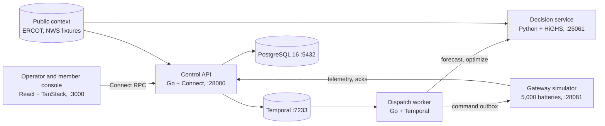

# GridOS

GridOS coordinates a distributed fleet of residential batteries as dependable
grid capacity while protecting each household's backup reserve. It forecasts
conditions, builds and validates safe dispatch plans, executes them through a
failure-tolerant workflow, and verifies the power actually delivered.
Members can choose a resilience plan or schedule Travel Flex; additional
capacity is used only when safety protections hold and conservative incremental
margin remains positive.

Hackathon tracks: **Orchestration** (5,000 independent batteries coordinated
through a durable workflow that survives gateway, network, and worker failures)
and **Most Commercializable** (member resilience plans, Travel Flex, and
verified settlement reports on top of what Base already operates).

## Quick start

Install Go 1.26+, `uv`, `pnpm`, Docker Compose, the PostgreSQL client (`psql`),
`buf`, and `sqlc`. Keep ports 5432, 7233, 3000, 8080, 25061, 28080–28081, and
9464–9467 free, then run from a clean checkout:

```sh
make plugins
make generate
pnpm --dir apps/console install --frozen-lockfile
make up
GRIDOS_STEP_UP_KEY=local-demo-key \
GRIDOS_DEMO_SCENARIO=testdata/scenarios/heat-event-canonical.yaml make demo
```

Open [the console](http://127.0.0.1:3000) after `demo ready` appears and follow
the [17-step operator walkthrough](docs/operations/demo.md). `make down` stops
PostgreSQL and Temporal and removes their volumes.

Tests: `make test-go`, `make test-py`, `make test-web`, and `make test-e2e`
(boots an isolated stack on separate ports and runs the vertical slice).

## Architecture



An operator requests capacity for an event. The decision service forecasts load
and availability, solves a reserve-respecting plan with HiGHS inside a hard time
budget, and falls back to a deterministic plan when the solver fails or runs
out of time. Every plan is independently re-validated before approval. A
Temporal workflow dispatches commands through a transactional outbox with
idempotency keys and generation fencing, reconciles acknowledgements and
telemetry, reallocates around devices that fail or go silent, and records an
audit row for every state transition. After the event it verifies measured
delivery against the baseline and produces a settlement report.

Contracts are Protobuf under `contracts/` (generated with `buf`), storage is
sqlc over PostgreSQL migrations in `database/`, and the product specification
is [`FULL_SPEC.md`](FULL_SPEC.md) with architecture detail in
[`TECHSTACK.md`](TECHSTACK.md).

## Configuration

`make demo` wires every service itself; no API keys or cloud accounts are
needed. The variables you may set:

A sample with the values the recorded demo uses is in `.env.example`:

```sh
cp .env.example .env
sed -i '' "s/replace-with-output-of-openssl-rand-hex-32/$(openssl rand -hex 32)/" .env
set -a; . ./.env; set +a; make demo
```

| Variable | Default | Purpose |
| --- | --- | --- |
| `GRIDOS_DEMO_SCENARIO` | unset | Scenario YAML under `testdata/scenarios/` that drives weather, prices, and failures |
| `GRIDOS_STEP_UP_KEY` | unset | Local HMAC key; when set, starts the local identity and step-up signer on :8080 that the console uses for approvals and emergency stop |
| `DEMO_DATABASE_URL` | local compose PostgreSQL | Database for the demo stack |
| `GRIDOS_DEMO_CONTROL_PORT`, `GRIDOS_DEMO_DECISION_PORT`, `GRIDOS_DEMO_GATEWAY_PORT` | 28080, 25061, 28081 | Service ports |
| `GRIDOS_DEMO_DIR` | `.local/demo` | Binaries, logs, and pids for the running stack |

## Data and provenance

Every datum carries a provenance label (`CONFIRMED_PUBLIC`, `SIMULATED`, and
so on) that the console displays. Full sources and hashes are in
[`DATASETS.md`](DATASETS.md) and `tools/data/MANIFEST.json`.

- **Public:** ERCOT day-ahead and real-time settlement point prices and load,
  NWS forecasts and alerts, residential load profiles, and Base Power's
  published fleet capacity and dispatch series. Small reviewed samples live in
  `testdata/fixtures/public/`; `tools/data` fetches and normalizes the rest.
- **Synthetic:** the 5,000-battery Austin fleet (`testdata/fleets/`) is
  generated deterministically by `tools/generation` with hashed identifiers and
  no personal data; scenarios in `testdata/scenarios/` inject heat events,
  outages, dropped telemetry, and gateway failures.

## Known limitations and next steps

- Every external system is a local substitute. Market, weather, outage,
  device, identity, settlement, and notification feeds are simulated or
  fixture-backed; each is listed in [`STUBS.md`](STUBS.md) with what retires it.
- Identity and step-up approval use a local signer in place of Clerk.
- Outage-risk forecasting is not wired into the served forecast yet.
- The AWS Terraform in `infrastructure/aws` has been planned against mock
  providers but never applied.
- Next: live ERCOT and NWS feeds, a real device command API, provider-backed
  identity, and a staging deployment.
