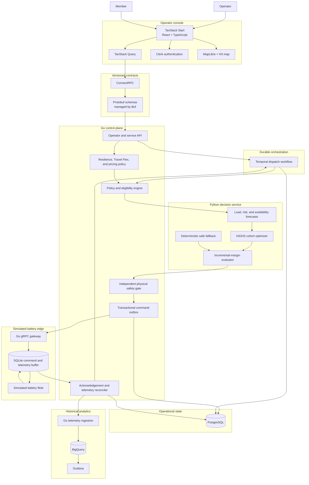

# GridOS technology stack

Status: accepted architecture for implementation  
Decision date: 2026-09-26

## System purpose

GridOS is a control-room system for a distributed fleet of residential
batteries. It observes fleet state, forecasts demand and risk, produces a safe
dispatch plan, sends versioned commands, recovers from failures, verifies
physical delivery, and records an auditable result.

```text
Observe -> Forecast -> Optimize -> Dispatch -> Verify -> Learn
```

The stack is designed around five properties:

1. A household's backup reserve is never silently relaxed.
2. Optimization and safety approval are independent responsibilities.
3. Commands and telemetry survive process restarts and network outages.
4. An acknowledgement proves receipt, while telemetry proves delivery.
5. Every demo and production event can be replayed from versioned inputs.
6. Member-selected flexibility is effective-dated, consented, economically
   justified, and subordinate to hardware and dynamic safety floors.

## System architecture



## Technology decisions

| Responsibility | Technology | Why it handles the work |
| --- | --- | --- |
| Operator console | TanStack Start, React, strict TypeScript | Provides routing, server functions, typed UI code, and a responsive application shell for an interactive control surface. |
| Remote state | TanStack Query | Handles caching, refetching, invalidation, and visible loading/error states without making browser state authoritative. |
| Styling | Tailwind CSS with a small owned component system | Enables fast, consistent UI construction without coupling the product to a large design-system dependency. |
| Authentication | Clerk | Provides hosted identity and session management. The Go service still enforces authorization for every privileged action. |
| Shared contracts | Protobuf managed by Buf | Generates consistent Go, Python, and TypeScript types and detects breaking schema changes. |
| Browser RPC | ConnectRPC with Connect-ES and Connect-Go | Provides browser-friendly typed RPC while keeping the Protobuf contract portable to standard gRPC. |
| Control plane | Go | Owns concurrent device I/O, deadlines, cancellation, state transitions, reconciliation, and safety enforcement. |
| Optimization and forecasting | Python with native HiGHS, NumPy, and Polars | Supplies the numerical and modeling ecosystem needed for rolling-horizon optimization and forecast evaluation. |
| Independent plan validation | Go | Prevents the optimizer from being the sole judge of its own output and blocks unsafe plans before command creation. |
| Active operational state | PostgreSQL | Provides transactions and conditional updates for event state, command intent, acknowledgements, policies, and audit records. |
| Go data access | `pgx` and `sqlc` | Keeps safety-critical SQL explicit while generating checked Go types. |
| Long-running workflows | Temporal with the Go SDK | Persists timers, retries, approval waits, command deadlines, recovery, and reconciliation across worker restarts. |
| Device and service transport | Protobuf over gRPC | Supplies efficient, versioned communication between control services and gateways. |
| Gateway implementation | Go | Models the concurrent, long-lived process that receives commands and publishes telemetry. |
| Edge persistence | SQLite | Retains accepted commands and unsent telemetry during gateway restarts or network loss. |
| Historical telemetry | BigQuery | Stores high-volume observations and supports replay, performance analysis, forecast evaluation, and settlement-style queries. |
| Fleet map | MapLibre with server-side H3 aggregation | Renders the fleet without a proprietary map token and enforces geographic privacy before data reaches the browser. |
| Build system | Bazel with Bzlmod | Provides reproducible builds, code generation, and targeted tests across Go, Python, TypeScript, Protobuf, and containers. |
| Local environment | Docker Compose | Starts the multi-service system and its dependencies from one documented command. |
| Deployment | Docker, Terraform, and AWS ECS | Produces reviewable infrastructure and a straightforward container deployment without requiring Kubernetes. |
| Warehouse identity | Workload Identity Federation | Allows AWS services to write to BigQuery without stored long-lived cloud keys. |
| Service observability | OpenTelemetry, Prometheus-compatible metrics, Grafana | Correlates workflows, commands, telemetry, failures, latency, and infrastructure behavior. |
| Web monitoring | Sentry | Associates browser and server errors with releases and user-visible workflows. |
| Product analytics | PostHog | Measures use of operator workflows without storing household identity or sensitive telemetry in analytics events. |

## Responsibility boundaries

### Operator console

The console displays fleet state, creates dispatch requests, shows approvals and
failures, and explains plans. It never owns authoritative command state and
cannot bypass server-side policy or safety validation.

### Go control plane

The control plane owns:

- Operator and service APIs
- Authentication context and authorization
- Event requests and measurement-boundary definitions
- Device eligibility and exclusion reasons
- Reserve and participation policies
- Effective-dated resilience plans, Travel Flex windows, consent, pricing
  catalogs, rewards, and safety overrides
- Independent validation of proposed schedules
- Transactional command intent and outbox publication
- Acknowledgement, telemetry, and uncertainty reconciliation
- Emergency-stop and superseding-command semantics
- Auditable state transitions

### Python decision service

The Python service owns:

- Home-load forecasts
- Outage-risk and reserve inputs
- Fleet-availability estimates
- Cohort construction
- Rolling-horizon HiGHS optimization
- Per-device schedule disaggregation
- A deterministic fallback plan
- Explicit feasible capacity and shortfall reporting
- Conservative incremental-margin estimates and reward ceilings

The service is bounded and replaceable. A timeout, crash, missing incumbent, or
invalid vector results in fallback or reported shortfall, never an unsafe plan.

### Temporal workflows

Temporal owns progression through the event lifecycle:

```text
REQUESTED
-> PLANNED
-> VALIDATED
-> APPROVED
-> COMMANDS_PERSISTED
-> SENT
-> ACKNOWLEDGED_OR_UNCERTAIN
-> EXECUTING
-> VERIFIED
-> RECONCILED
-> REPORTED
```

Temporal manages durable time, retries, signals, and worker recovery. It does
not replace PostgreSQL command intent, receiver deduplication, or telemetry
verification.

### PostgreSQL

PostgreSQL stores current operational truth:

- Dispatch requests, events, and plan versions
- Input and eligibility snapshots
- Reserve and policy versions
- Resilience-plan selections, Travel Flex windows, consent records, early
  returns, pricing snapshots, offered rewards, and reward-ledger entries
- Command intent and transactional outbox
- Per-command state and acknowledgements
- Signed feasible-power uncertainty intervals
- Operator approvals and emergency-stop requests
- Verification summaries and audit history
- Workflow and business correlation IDs

### Gateway simulator and SQLite

The gateway simulator exercises the real failure boundary. It:

1. Receives a versioned command.
2. Persists it locally before acknowledging it.
3. Rejects duplicate IDs and obsolete generations.
4. Enforces effective and expiry times.
5. Simulates battery response and failure conditions.
6. Stores telemetry locally before publishing it.
7. Deletes buffered telemetry only after confirmed cloud receipt.
8. Reconnects and forwards accumulated observations after an outage.

### BigQuery

BigQuery stores append-oriented history:

- Immutable raw telemetry
- Normalized and reconciled telemetry
- Forecasts and actuals
- Dispatch and verification facts
- Data-quality and missingness facts
- Replay inputs
- Settlement-style calculations

BigQuery is not queried by the safety gate or command-delivery path.

## Service contracts

Create the versioned package `gridos.v1` before application features:

```text
contracts/gridos/v1/
  device.proto
  telemetry.proto
  dispatch.proto
  optimization.proto
  verification.proto
  member_policy.proto
  pricing.proto
```

The package defines at least:

- `DispatchEvent`
- `EventRequest`
- `EligibilitySnapshot`
- `ReservePolicy`
- `ResiliencePlan`
- `TravelFlexWindow`
- `ReserveOverride`
- `PricingCatalogSnapshot`
- `FlexibilityOffer`
- `MarginEstimate`
- `HomeActivityAlert`
- `OptimizationRequest`
- `DispatchPlan`
- `DeviceSchedule`
- `CommandIntent`
- `CommandAcknowledgement`
- `TelemetryObservation`
- `DeliveryVerification`
- `UncertaintyInterval`
- `ShortfallReport`

Commands include an immutable command ID, idempotency key, device and event IDs,
plan version, generation, absolute setpoint, issue/effective/expiry times,
policy version, and correlation ID.

Telemetry distinguishes source time, receive time, and observation time. It
states units, sign convention, sequence, quality flags, and measurement
boundary. Missing, stale, unknown, and zero are distinct states.

Pricing, reserve, and Travel Flex contracts are effective-dated. They preserve
the consent text and catalog version shown to the member. Membership fees,
energy prices, installation prices, and flexibility rewards are distinct
fields so markets with different commercial structures do not inherit an
invalid universal discount.

## Safety and delivery semantics

An acknowledgement is not delivery. A send whose acknowledgement is lost moves
to an uncertain state. Its signed feasible-power interval is derived from the
last confirmed command, the possibly accepted new command, effective and expiry
times, ramp behavior, and fresh telemetry. The system does not blindly replace
capacity that may still be operating.

The Go safety gate reconstructs and checks:

- Finite values and expected vector lengths
- Charge and discharge power bounds
- No simultaneous charge and discharge under the device contract
- Energy balance using interval duration and one-way efficiencies
- Energy and reserve bounds at every interval
- Availability, maintenance, participation, and telemetry freshness
- Meter export and interconnection limits
- The event target at one explicit measurement boundary
- Command generation, effective time, expiry, and policy version
- Declared shortfall and uncertainty

The effective reserve is the maximum of the protected hardware floor, the
member's active plan floor, and any dynamic safety override for outage risk,
weather, battery health, or uncertain state. A displayed `0%` plan therefore
means zero customer-designated reserve above protected limits, never physical
zero state of charge. Travel Flex cannot lower reserve before its consented
start, after expiry, after early return, or while a safety override is active.
The economics gate separately rejects extra flexibility when conservative
incremental margin does not clear its configured hurdle.

Infeasible demand produces a quantified shortfall. The system never relaxes a
household reserve or fabricates delivery to satisfy a target.

## Verification strategy

### Go

- Table-driven unit tests
- Property and model-based command-state tests
- PostgreSQL integration tests using disposable databases
- Temporal replay and time-skipping tests
- Real gRPC tests against the gateway simulator

### Python

- `pytest`
- Hypothesis invariants for energy, power, reserve, and shortfall
- Matrix-level and physical validation
- Golden fixtures shared with the retained TypeScript benchmark
- Timeout, no-incumbent, invalid-vector, and fallback cases

### TypeScript and browser

- Strict TypeScript
- ESLint and formatting gates
- Vitest and Testing Library
- Playwright for the complete operator flow
- Buf lint and breaking-change checks

### Required end-to-end scenarios

- Deterministic 5,000-site heat-event dispatch
- Initially under-reserved devices excluded and reported
- Twenty percent of Houston devices disconnected
- Lost acknowledgement where the device may still execute
- Old command expiry while a newer unacknowledged command remains possible
- Control or workflow worker termination and recovery
- Gateway restart with retained commands
- Network outage followed by SQLite telemetry replay
- Optimizer timeout and deterministic fallback
- Infeasible target with visible per-interval shortfall
- Measurement gaps that remain unknown rather than becoming zero delivery
- Travel Flex activation, automatic expiry, and early-return cancellation
- Severe weather, stale telemetry, and device alarms raising the reserve floor
- A zero-percent customer reserve that still preserves protected device limits
- Negative incremental margin causing no additional dispatch
- Market-specific rewards where no membership fee exists to waive
- Energy-anomaly notification labeled as a signal rather than an intrusion

## Repository layout

This is the target layout for the complete product. A directory is created only
when its first real implementation file exists. Do not pre-create empty layers,
placeholder packages, or speculative services.

```text
Base-GridOS/
├── README.md                 Product entry point and working commands
├── FULL_SPEC.md              Authoritative product and safety requirements
├── TECHSTACK.md              Architecture and repository ownership
├── DATASETS.md               Available-data and provenance inventory
├── AGENTS.md                 Short implementation rules, added with the app
├── MODULE.bazel              Build graph, added with the first build target
│
├── apps/
│   └── console/              TanStack operator application
│       ├── src/
│       │   ├── fleet/        Fleet state and availability
│       │   ├── dispatch/     Planning, approval, and launch
│       │   ├── map/          Geographic and electrical views
│       │   ├── events/       Live execution, verification, and reports
│       │   └── api/          Generated client and browser boundary
│       └── tests/            Console-level behavior tests
│
├── services/
│   ├── control/              Go control plane and Temporal workers
│   │   ├── cmd/              Executable entry points
│   │   ├── internal/
│   │   │   ├── fleet/        Twin, eligibility, and policy
│   │   │   ├── dispatch/     Event lifecycle and workflows
│   │   │   ├── safety/       Independent physical validation
│   │   │   ├── reconciliation/ Acknowledgement and delivery truth
│   │   │   ├── analytics/    Optional historical export
│   │   │   └── storage/      PostgreSQL, outbox, and sqlc adapters
│   │   └── tests/            Go service integration tests
│   │
│   ├── decision/             Python forecasting and optimization
│   │   ├── gridos/
│   │   │   ├── forecasting/  Load, risk, and availability models
│   │   │   ├── optimization/ HiGHS model and disaggregation
│   │   │   ├── validation/   Independent numerical result checks
│   │   │   └── fallback/     Deterministic conservative planner
│   │   └── tests/            Model and physical-invariant tests
│   │
│   └── gateway-simulator/    Go edge gateway and battery simulator
│       ├── cmd/              Simulator entry point
│       ├── internal/
│       │   ├── gateway/      Command receipt and SQLite buffering
│       │   ├── battery/      Physical device behavior
│       │   ├── telemetry/    Measurement production and replay
│       │   └── failures/     Seeded fault injection
│       └── tests/            Gateway recovery and protocol tests
│
├── contracts/                Shared Protobuf contracts managed by Buf
│   └── gridos/v1/
│       ├── device.proto
│       ├── telemetry.proto
│       ├── dispatch.proto
│       ├── optimization.proto
│       └── verification.proto
│
├── database/
│   ├── migrations/           PostgreSQL schema history
│   ├── queries/              sqlc source queries
│   └── seeds/                Development-only reference state
│
├── testdata/
│   ├── fixtures/             Small permitted public-data samples
│   ├── fleets/               Deterministic synthetic fleets
│   └── scenarios/            Replayable demo and failure definitions
│
├── tests/
│   ├── contract/             Cross-language schema compatibility
│   ├── integration/          Cross-service behavior
│   └── end-to-end/           Complete operator and dispatch paths
│
├── infrastructure/
│   ├── local/                Docker Compose and local configuration
│   ├── aws/                  Terraform for deployed infrastructure
│   └── observability/        OpenTelemetry and Grafana configuration
│
├── tools/
│   ├── data/                 Dataset fetch, checksum, and normalization
│   ├── generation/           Contract and fixture generation
│   └── development/          Small developer utilities
│
└── docs/                     Durable detail that no longer fits root specs
    ├── domain/               Battery physics and measurement rules
    ├── decisions/            Architecture decision records
    ├── operations/           Runbooks and recovery procedures
    └── data/                 Source and integration notes
```

### Navigation and ownership rules

- Product behavior and acceptance criteria belong in `FULL_SPEC.md`.
- Technology and ownership decisions belong in `TECHSTACK.md`.
- Source availability and provenance belong in `DATASETS.md`.
- Browser behavior belongs in `apps/console`; it never becomes command truth.
- Runtime behavior belongs to the service that owns it. Do not add a generic
  shared service or utility layer to avoid choosing an owner.
- Unit tests stay beside the code they protect. Root `tests/` is reserved for
  behavior that crosses a language, process, or service boundary.
- `testdata/` contains only compact, reviewable fixtures and deterministic
  scenarios. Full historical downloads are ignored local caches or external
  objects, not repository contents.
- `docs/` is created only when durable detail cannot remain clear in a root
  specification or beside the implementation. It is not a holding area for
  planning transcripts, generated reports, or temporary research.
- `tools/` contains maintained, reusable automation. One-off investigation
  scripts and generated outputs do not become permanent product structure.
- A new top-level directory or independently deployed service requires a clear
  owner, runtime boundary, and current use case.

## Local and deployed topology

The local demo starts from one documented command. Docker Compose runs
PostgreSQL and application services; Temporal runs in development mode;
BigQuery is replaced by a fixture-backed sink unless explicitly enabled. The
judged path requires no live external API or cloud credential.

The deployment target is containerized services on AWS ECS managed by
Terraform. BigQuery access uses workload identity federation. The application
contract does not depend on whether Temporal is managed or self-hosted.

## Deliberate exclusions

- No Kubernetes until workload or organizational requirements justify it.
- No Kafka, NATS, RabbitMQ, or Redis until measured throughput or fan-out shows
  that PostgreSQL outbox, Temporal, and gRPC are insufficient.
- No PGlite or central SQLite as the operational store.
- No TypeScript production control plane.
- No WASM solver as the selected production optimizer.
- No DuckDB or BigQuery in the active command path.
- No direct device command from the browser or AI copilot.
- No synthetic fallback presented under a real-data provenance label.

## Implementation sequence

1. Define the event measurement boundary, duration, sign convention, reserve
   contract, command semantics, and `gridos.v1` schemas.
2. Build the Go gateway simulator with SQLite store-and-forward and deterministic
   telemetry.
3. Implement the Python optimizer and fallback against shared golden fixtures.
4. Implement the independent Go safety validator and differential tests.
5. Add PostgreSQL event state, audit journal, and transactional command outbox.
6. Add the Temporal dispatch and reconciliation workflow.
7. Build the TanStack operator console and complete Playwright demo path.
8. Add BigQuery telemetry export and replay analytics behind an optional sink.
9. Add resilience plans, Travel Flex, versioned offers, reward accounting, and
   the conservative incremental-margin gate.
10. Add Terraform/ECS deployment and production observability.
