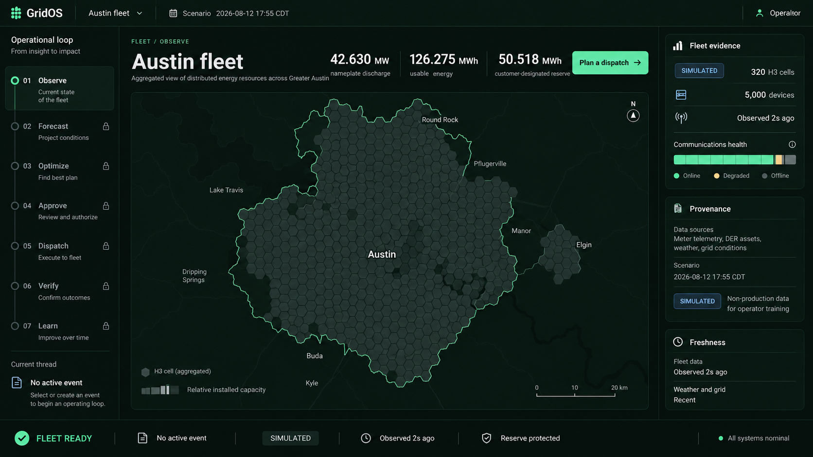
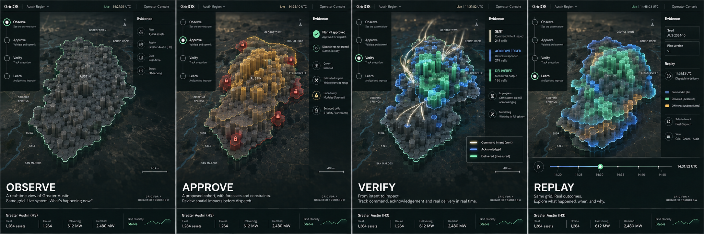

# GridOS operator console visual proposals

These proposals apply the golden visual system to the same connected product.
They are not separate sites. Both use the persistent console shell, the
operating-loop navigation, the event thread, and the Greater Austin Living
Grid.

The generated images establish art direction and composition. Generated text
and values are not implementation specifications. The console renders only
values supplied by validated contracts and fixtures.

| Proposal A: Evidence-first control room | Proposal B: Cinematic Living Grid |
| --- | --- |
|  |  |

## Proposal A: Evidence-first control room

Proposal A treats the static operational frame as the primary experience. A
stable twelve-column shell places the operating loop on the left, the Greater
Austin H3 field in the center, evidence on the right, and persistent truth in
the bottom status strip.

The Living Grid is a restrained geographic relief rather than a cinematic
object. Capacity creates structure, but operational color appears only when a
named server value supports it. The composition remains useful before the
renderer loads and communicates correctly as a still image.

### Strengths

- Highest immediate legibility and lowest interaction risk.
- Strong fit for long operator sessions and dense evidence.
- Straightforward reduced-motion and no-WebGL equivalence.
- Lower rendering, authoring, testing, and maintenance cost.
- Excellent baseline for accessibility and performance budgets.

### Limitations

- Resembles a premium dashboard more than a singular spatial product.
- Route continuity is structurally clear but not emotionally memorable.
- The scale and causality of the fleet are less dramatic during a live demo.
- Approval, dispatch, verification, and replay depend more heavily on charts.

### Best use

Proposal A is the required static composition, reduced-motion state, no-WebGL
fallback, and low-quality rendering tier. It is also the operational shell
beneath every enhanced state in Proposal B.

## Proposal B: Cinematic Living Grid

Proposal B makes one persistent real-time Greater Austin field the product's
spatial protagonist. The semantic shell remains anchored while the camera,
cell topology, and evidence-bearing layers transform as the event moves through
Observe, Forecast, Optimize, Approve, Dispatch, Verify, and Learn.

The experience borrows the connected spatial authorship of the golden 3D
references without copying their subjects or turning the console into a scroll
story. Server state, route focus, and one replay timestamp drive the scene.
Scroll never launches or controls an operational action.

### State sequence

| Stage | Spatial treatment | Truth boundary |
| --- | --- | --- |
| Observe | Neutral extruded H3 capacity field with one regional selection outline | No per-cell availability color until the server supplies it |
| Forecast | Blue uncertainty envelope surrounds candidate capacity | Forecast issue time, model version, interval, and provenance remain visible |
| Optimize | Eligible cells form a cohort while exclusions separate by named reason | Topology follows the versioned plan explanation |
| Approve | Unsafe cells lock out and the entire field holds still | Approval does not cause energy motion |
| Dispatch | A white command trace enters approved cells | Motion begins only after `WatchEvent` reports `SENT` |
| Verify | Blue acknowledgement perimeters and mint telemetry delivery separate from sent intent | Acknowledgement never implies physical delivery |
| Learn | Commanded and measured forms remain offset by their residual | Replay uses one timestamp, seed, plan version, and ordered updates |

### Strengths

- Makes all routes feel like views into one governed system.
- Turns the 17-step demonstration into a causal visual narrative.
- Gives approval, failure handling, verification, and replay memorable proof.
- Communicates fleet scale and command-versus-response faster than cards alone.
- Matches the ambition of the golden spatial references while preserving DOM
  ownership of actions and evidence.

### Risks and controls

- The renderer can dominate the product unless each route has one focal event.
- Cinematic motion can misstate operations unless every transition has a named
  server trigger.
- MapLibre and the Living Grid cannot render concurrently; the grid parks on
  `/map` and resumes with context intact.
- The spatial chunk loads after useful HTML, uses instancing, caps DPR at 1.5,
  pauses when hidden, and disposes with the shell.
- Proposal A remains the exact fallback when WebGL, motion, power, or budget
  constraints require it.

## Recommendation

Build Proposal B as the enhanced experience and Proposal A as its static truth
frame, reduced-motion composition, no-WebGL fallback, and low-quality tier.
This is one architecture with progressive depth rather than two competing
products.

The shell must be complete before spatial enhancement. The first enhanced
release earns only the Observe transformation. Approval, dispatch,
verification, and replay effects ship when their contracts and recorded
fixtures exist.

## Acceptance direction

- One shell-owned renderer, one scene state, and one animation clock.
- One focal transformation per route.
- Every consequential action remains semantic DOM.
- Sent, acknowledged, and delivered use distinct geometry and labels.
- No dispatch motion before server-confirmed `SENT`.
- No verified state before telemetry.
- H3 aggregates only unless exact-site permission is granted.
- All 17 demo steps remain passable under reduced motion and without WebGL.
- Release score at least 18 of 20 with no zero in truth, safety,
  accessibility, or fallback.
